# Model Context Protocol (MCP) 技术分享

## 目录
- [什么是 MCP](#什么是-mcp)
- [背景与痛点](#背景与痛点)
- [MCP 解决方案](#mcp-解决方案)
- [完整的大模型调用 MCP 流程](#完整的大模型调用-mcp-流程)
- [总结](#总结)


## 什么是 MCP

Model Context Protocol (MCP) 是由 Anthropic 开发的**开源标准协议**，旨在为大模型应用提供安全、标准化的外部工具连接方式。

**核心价值**：统一工具调用标准，避免重复实现，提升开发效率。


## 背景与痛点

### 大模型应用开发面临的挑战


在 MCP 出现以前，每个大模型应用都要自己实现方法以获取外部数据。
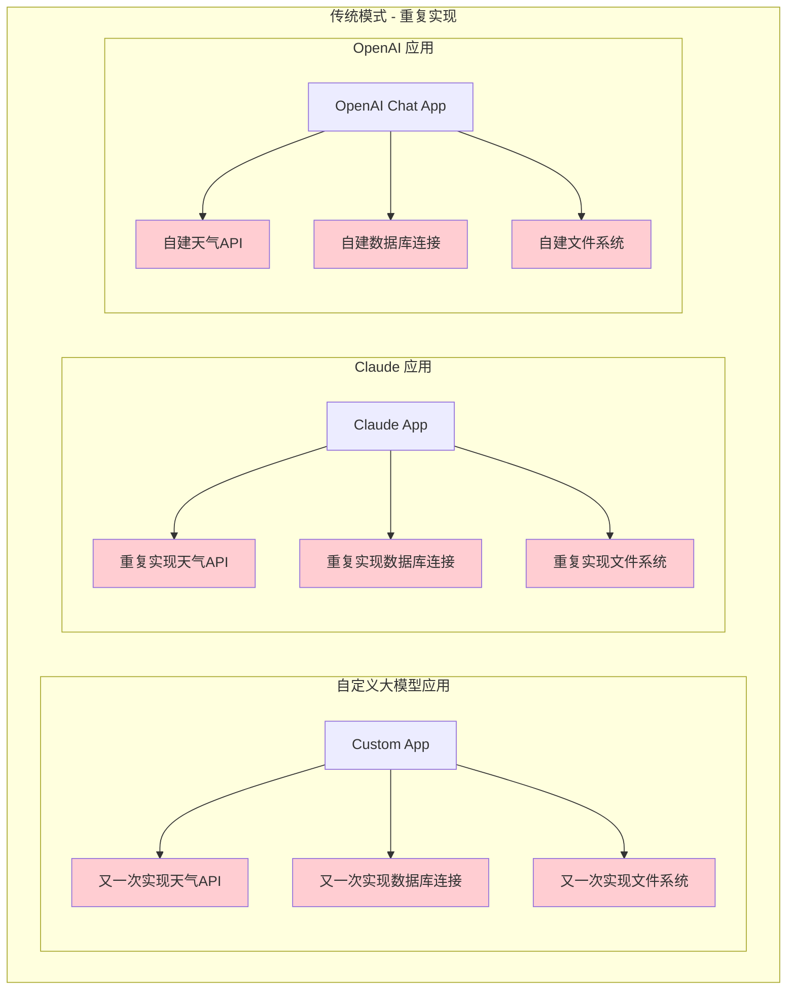


### 场景举例
假如你正在开发一个大模型聊天应用，当用户询问天气时，你希望能通过某些方法获取到真实的天气信息，再交给大模型来回答。

如果你选择了 OpenAI：
```typescript
// OpenAI Function Call 示例

const functions = [
  {
    name: "get_weather",
    description: "获取指定城市的天气信息",
    parameters: {
      type: "object",
      properties: {
        city: { type: "string", description: "城市名称" }
      },
      required: ["city"]
    }
  }
  // 其它功能
  // {...}
];

// get_weather 功能实现函数
async function get_weather(city: string) {
  const response = await fetch(`https://api.weather.com/v1/current?key=${API_KEY}&q=${city}`);
  return response.json();
}

// 其它功能
// async function ...

// GPT 调用流程
const response = await openai.chat.completions.create({
  model: "gpt-4",
  messages: [{ role: "user", content: "上海今天天气怎么样?" }],
  functions: functions,
  function_call: "auto"
});

// 如果 GPT 决定调用函数
if (response.choices[0].message.function_call) {
  // get_weather
  const functionName = response.choices[0].message.function_call.name;
  // { city: '上海' }
  const functionArgs = JSON.parse(response.choices[0].message.function_call.arguments);
  
  // 手动分发调用对应的函数，获取结果
  let functionResult;
  switch (functionName) {
    case "get_weather":
      functionResult = await get_weather(functionArgs.city);
      break;
    // 需要为每个函数写 case...
  }

  // 后续再次进入 GPT 调用流程，把 functionResult 通过 messages 传递给大模型
}
```
假如另一个开发者 B 和你有同样的想法，那 get_weather 定义和函数实现就要由开发者 B 自己再实现一次。

假如另一个开发者 C 和你有同样的想法，但他选择了 Anthropic：
```typescript
// Anthropic Tool Call 示例

const tools = [
  {
    name: "get_weather",
    description: "获取指定城市的天气信息",
    input_schema: {
      type: "object",
      properties: {
        city: {
          type: "string",
          description: "城市名称"
        }
      },
      required: ["city"]
    }
  }
];

// get_weather 功能实现函数
async function get_weather(city: string) {
  const response = await fetch(`https://api.weather.com/v1/current?key=${API_KEY}&q=${city}`);
  return response.json();
}

// Claude API 调用流程
const response = await anthropic.messages.create({
  model: "claude-3-5-sonnet-20241022",
  tools: tools,
  messages: [
    { role: "user", content: "上海今天天气怎么样?" }
  ]
});

// 处理 Claude 的工具调用
for (const content of response.content) {
  if (content.type === "tool_use") {
    const toolName = content.name;
    const toolInput = content.input;
    
    // 手动分发调用对应的函数，获取结果
    let toolResult;
    switch (toolName) {
      case "get_weather":
        toolResult = await get_weather(toolInput.city);
        break;
      // 需要为每个工具写 case...
    }

    // 后续再次进入 Claude 调用流程，把 functionResult 通过 messages 传递给大模型
```


Function Call / Tool Call 流程总结：

可以发现大部分流程基本都是一样的，但是每个应用都要重复实现 get_weather 函数功能。
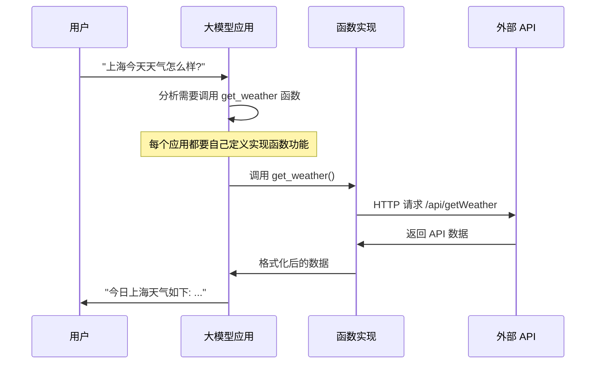

### 问题小结
- 开发效率低，重复造轮子
- 缺乏标准化，每个大模型供应商有不同的 call 实现，需要同步兼容
- 维护成本高，API 变更需要修改多个客户端应用，每个 API 返回数据结构都不一样
- 耦合的业务逻辑且复杂的权限控制


## MCP 解决方案

### 统一架构

MCP 三个架构要素：
- Server
- Client
- Protocol

MCP 采用经典 C/S 架构：**MCP Server** 提供工具实现，大模型应用通过 **MCP Client** 连接获取工具。
  
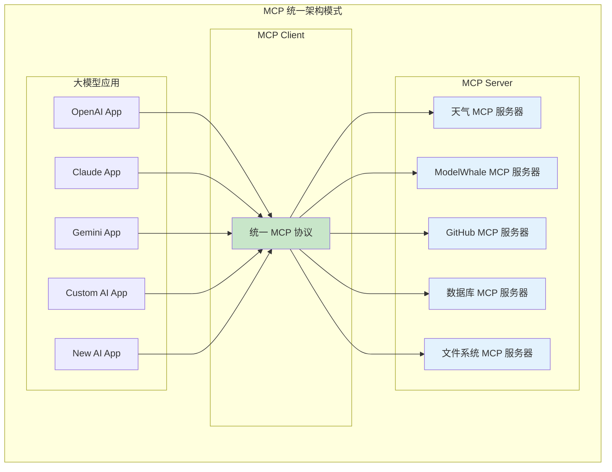

### 统一通信消息协议
MCP Client 和 MCP Server 间约定使用 **JSON-RPC 2.0** 协议进行结构化通信。**JSON-RPC 2.0** 是一种轻量级的远程过程调用（RPC）协议，使用 JSON 作为编码格式。该协议设计简单，不依赖于特定的传输协议（HTTP/TCP/进程/管道等等）。
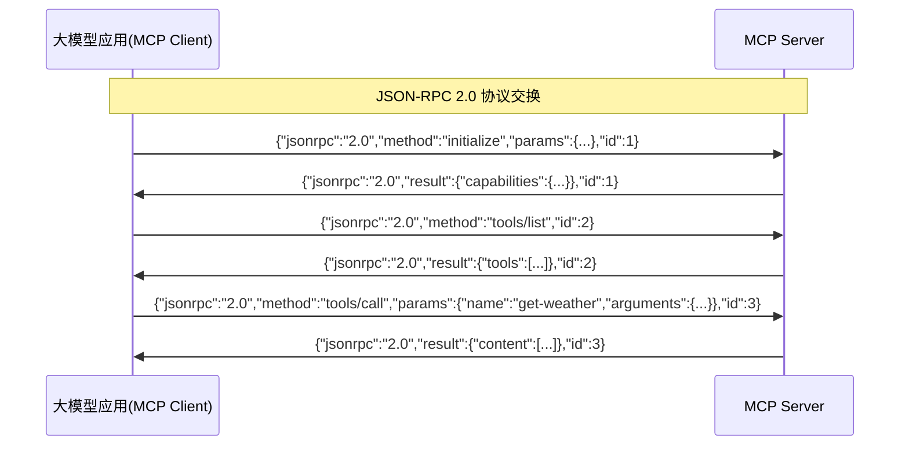

### 统一传输协议
- **Stdio Transport**: 基于操作系统标准输入输出的通信，适合本地命令行工具和桌面应用。
- **SSE Transport**: 专为 SSE 设计，使用传统的 SSE 协议进行服务器到客户端的单向流式通信。
- **StreamableHTTP Transport**⭐️: HTTP 流式传输方案，可选流式响应或纯 JSON 响应。

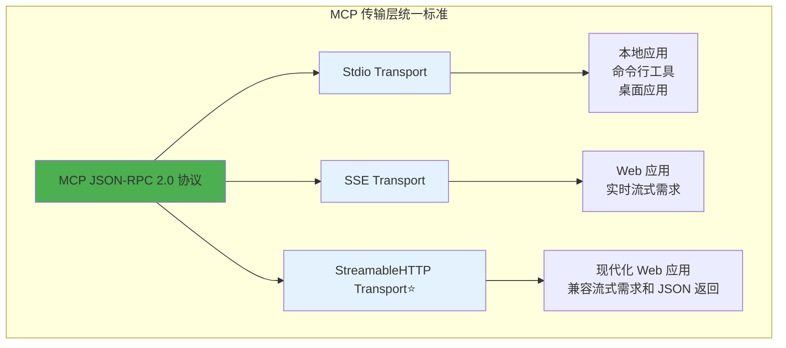


### MCP Client 简单示例

**核心优势**：所有大模型应用共享统一的连接和调用方式。

```typescript
import { Client } from '@modelcontextprotocol/sdk/client/index.js';
import { StreamableHTTPClientTransport } from '@modelcontextprotocol/sdk/client/streamableHttp.js';

// 🎯 统一的 MCP 基础类
class BaseMCPApp {
  protected mcpClient: Client;
  
  async initialize() {
    this.mcpClient = new Client({ name: 'ai-app', version: '1.0.0' });
    const transport = new StreamableHTTPClientTransport('https://api.example.com/mcp');
    await this.mcpClient.connect(transport);
  }
  
  // 统一工具调用接口 - 所有平台复用
  async callTool(toolName: string, args: any) {
    return await this.mcpClient.callTool(toolName, args);
  }
  
  async getTools() {
    const { tools } = await this.mcpClient.listTools();
    return tools;
  }
}

// 🤖 OpenAI 应用实现
class OpenAIMCPApp extends BaseMCPApp {
  async processMessage(userMessage: string) {
    const tools = await this.getTools();
    
    // 只需转换格式，无需实现工具逻辑
    const openaiTools = tools.map(tool => ({
      name: tool.name,
      description: tool.description,
      parameters: tool.inputSchema
    }));
    
    const response = await openai.chat.completions.create({
      model: "gpt-4",
      messages: [{ role: "user", content: userMessage }],
      functions: openaiTools
    });
    
    if (response.choices[0].message.function_call) {
      const { name, arguments: args } = response.choices[0].message.function_call;
      // 统一调用方式
      const result = await this.callTool(name, JSON.parse(args));
      return result.content[0].text;
    }
  }
}

// 🎭 Claude 应用实现
class ClaudeMCPApp extends BaseMCPApp {
  async processMessage(userMessage: string) {
    const tools = await this.getTools();
    
    // 只需转换格式，无需实现工具逻辑
    const claudeTools = tools.map(tool => ({
      name: tool.name,
      description: tool.description,
      input_schema: tool.inputSchema
    }));
    
    const response = await anthropic.messages.create({
      model: "claude-3-5-sonnet-20241022",
      tools: claudeTools,
      messages: [{ role: "user", content: userMessage }]
    });
    
    for (const content of response.content) {
      if (content.type === "tool_use") {
        // 统一调用方式
        const result = await this.callTool(content.name, content.input);
        return result.content[0].text;
      }
    }
  }
}
```


### MCP Server 简单示例

```typescript
import { McpServer } from '@modelcontextprotocol/sdk/server/mcp.js';
import { StreamableHTTPServerTransport } from '@modelcontextprotocol/sdk/server/streamableHttp.js';
import express from 'express';
import { z } from 'zod';

const server = new McpServer({
  name: 'modelwhale-mcp-server',
  version: '1.0.0'
});

// 注册工具：获取项目列表
server.tool(
  'get-lab-list',
  '获取我的项目列表',
  {
    page: z.number().min(1).optional().default(1).describe('页码'),
    perPage: z.number().min(1).optional().default(10).describe('每页返回的项目数量')
  },
  async ({ page, perPage }) => {
    const params = new URLSearchParams({
      page: `${page}`,
      perPage: `${perPage}`,
    });

    const response = await fetch(`${MODELWHALE_BASE_URL}/api/user/labs?${params}`);
    const data = await response.json();

    return {
      content: data.data.map((v) => ({
        type: 'text',
        text: [
          `项目名称: ${v.Title}`,
          `项目描述: ${v.Description || '无'}`,
          `更新时间: ${v.UpdateDate}`,
          `项目 ID: ${v._id}`
        ].join('\n'),
      })),
    };
  }
);

const app = express();
app.use(express.json());
app.all('/mcp', async (req, res) => {
  // 创建并连接 MCP Server
  const transport = new StreamableHTTPServerTransport({
    // ...
  });
  await server.connect(transport);
  // 处理请求
  await transport.handleRequest(req, res, req.body);
});
```

**关键收益**：
- ✅ **零重复代码**：工具逻辑在 MCP Server 统一实现
- ✅ **统一维护**：MCP Server 更新，所有应用立即受益
- ✅ **快速集成**：新应用只需要格式转换，无需重写工具
- ✅ **标准化调用**：`this.callTool(name, args)` 适用于任何工具


## 大模型与 MCP 的完整调用流程

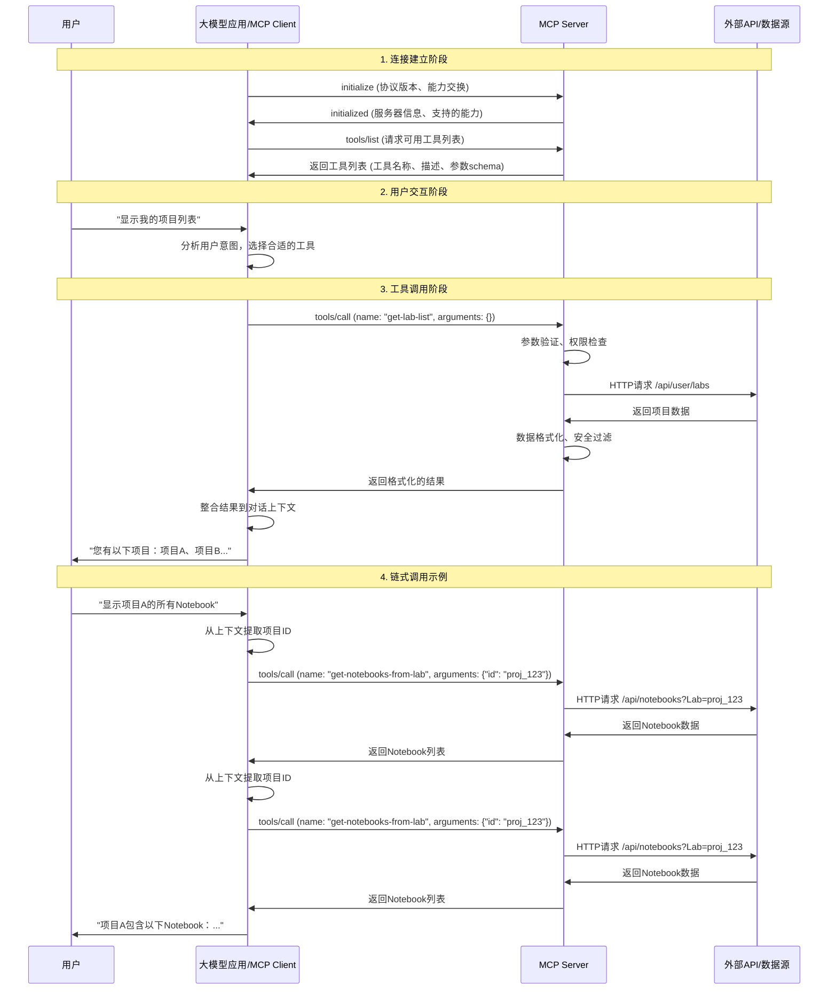


## MCP 核心优势

### 1. 解决重复实现问题

#### 传统方式：各自为政
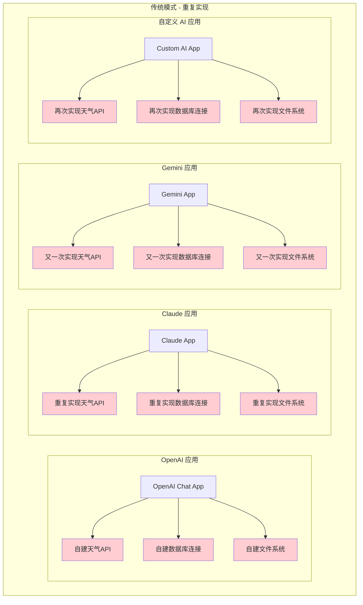

#### MCP 方式：统一复用
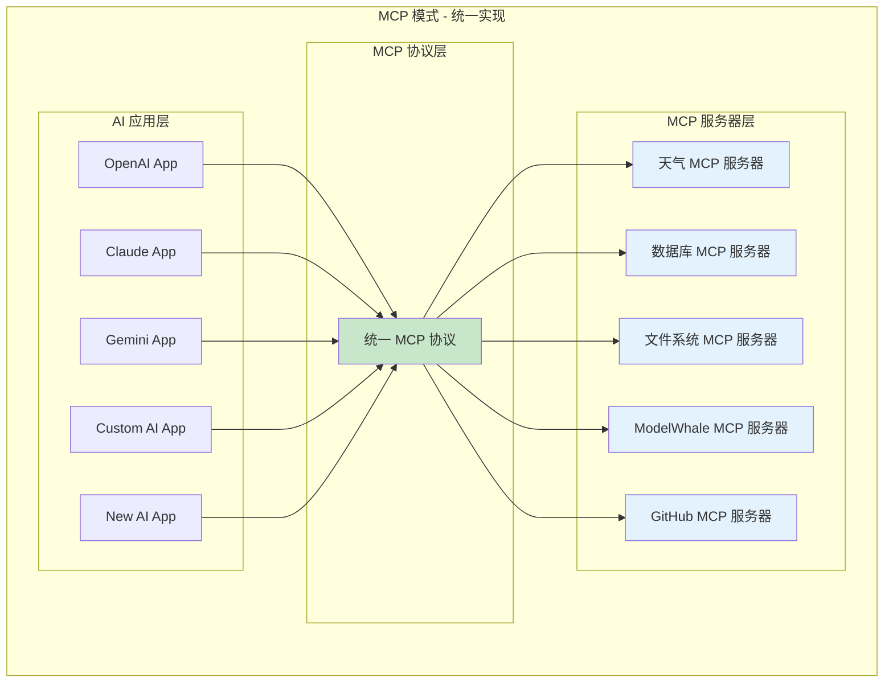

### 2. 维护成本对比

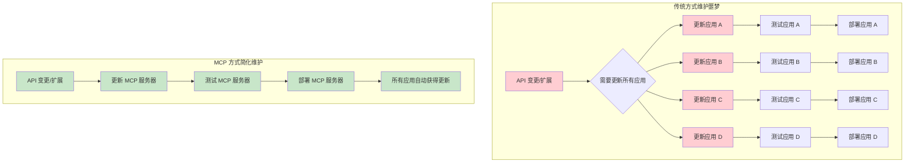

### 4. 标准化优势

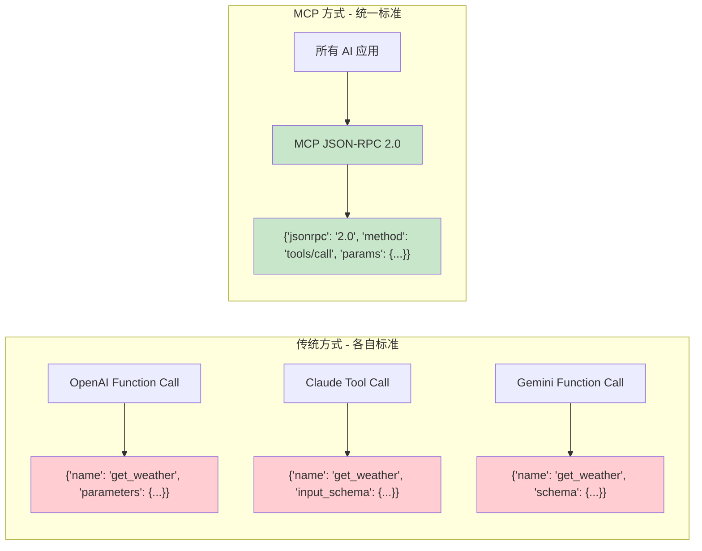

### 5. 安全性提升

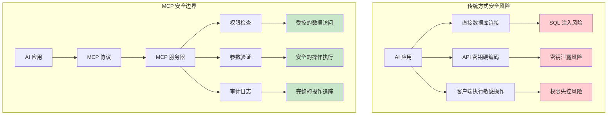


## MCP 高级用法

### 权限分级控制
不同用户或应用可以有不同的工具访问权限：
```typescript
async function checkPermission(toolName: string, userId: string) {
  const userRole = await getUserRole(userId);
  const requiredPermission = TOOL_PERMISSIONS[toolName];
  return hasPermission(userRole, requiredPermission);
}
server.tool(
  'admin-operation',
  '管理员操作',
  { action: z.string() },
  async ({ action }, context) => {
    const userId = context.userId;
    if (!await checkPermission('admin-operation', userId)) {
      throw new Error('权限不足');
    }
    return await executeAdminAction(action);
  }
);
```

### 缓存优化
对频繁调用的工具结果进行缓存：
```typescript
const cache = new Map();

server.tool(
  'expensive-computation',
  '昂贵的计算操作',
  { input: z.string() },
  async ({ input }) => {
    const cacheKey = `compute_${hash(input)}`;
    if (cache.has(cacheKey)) {
      return cache.get(cacheKey);
    }
    const result = await performExpensiveComputation(input);
    cache.set(cacheKey, result);
    return result;
  }
);
```

### 流式处理
对于大量数据或长时间运行的任务，支持流式响应：
```typescript
server.tool(
  'analyze-large-dataset',
  '分析大型数据集',
  { datasetId: z.string() },
  async function* ({ datasetId }) {
    const chunks = await getDatasetChunks(datasetId);
    
    for (const chunk of chunks) {
      const result = await processChunk(chunk);
      yield {
        content: [{
          type: 'text',
          text: `处理进度: ${result.progress}%\n结果: ${result.summary}`
        }]
      };
    }
  }
);
```

### 资源管理
除了工具调用，MCP 还支持资源管理，允许大模型访问文件、数据库记录等。

```typescript
// 注册资源
server.resource(
  'file:///projects/{projectId}/files',
  '项目文件列表',
  async ({ projectId }) => {
    const files = await getProjectFiles(projectId);
    return {
      contents: files.map(file => ({
        uri: `file://${file.path}`,
        mimeType: 'text/plain',
        text: file.content
      }))
    };
  }
);

// 客户端读取资源
const resources = await mcpClient.readResource('file:///projects/123/files');
```


## 总结
MCP 正成为 AI 应用生态的重要基础设施，让开发者专注于 AI 应用的核心逻辑，而不必为每个外部数据读取重复实现代码。

### MCP 的核心价值
- **统一标准**: 降低集成成本，避免重复开发
- **安全可控**: 统一权限管理和审计
- **易于扩展**: 插件化架构，快速增加新功能
- **生态共享**: 促进工具复用，形成网络效应

### 适用场景
- 🎯 **企业 AI 应用**: 访问内部系统和数据
- 🎯 **开发者工具**: IDE 插件和代码助手  
- 🎯 **数据分析**: 多数据源集成
- 🎯 **客户服务**: CRM 和知识库集成


---

**参考资料**:
- [MCP 官方文档](https://modelcontextprotocol.io/)
- [MCP SDK](https://github.com/modelcontextprotocol/typescript-sdk)
- [示例项目](https://gitlab-a3uxyvfhkudlt7.kesci.com/joy-yu/modelwhale-mcp-test)
- [MCP Tools 收录站(mcp.so)](https://mcp.so/zh)
- [MCP Tools 收录站(smithery.ai)](https://smithery.ai)
